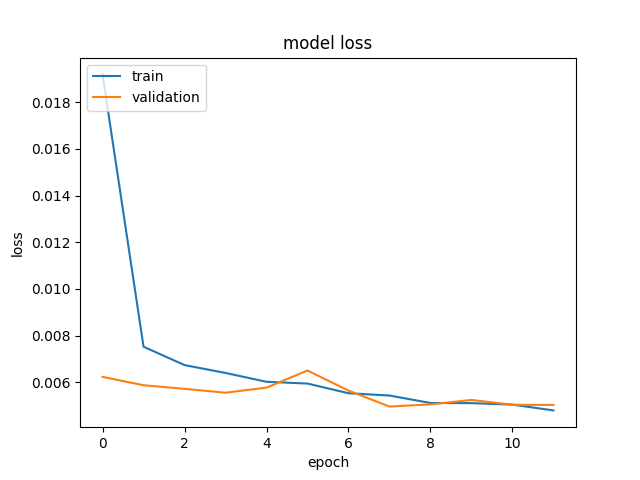

# Driving Behaviorial Cloning using Deep Learning

*This work is licensed under a Creative Commons Attribution-NonCommercial-ShareAlike 4.0 International License. 
Alberto S. Naranjo Galet 2017*

Overview
---

A deep convolutional neural network in Keras that predicts steering angles from video still frames, using a training dataset with augmentation and preprocessed validation set.

**[Video of the model driving the car simulator](https://www.youtube.com/watch?v=CcBMLfuedPE)**

## Model Architecture

The model architecture (clone.py lines 402-467) is based on a modified Nvidia model, consisted of a convolution neural network with several dropouts and some fully connected layers.

The input is normalized around zero and I used a square 128x128x3 image size.
The network has 24 layers plus output value. There are 10 layers with learnable weights: 5 convolutional layers, and 5 fully connected layers.

|	#	|	Type			|	Description													|
|---	|---				|---															|
|	1	|	Input			|	128x128x3 images input normalized to `zero`. 				|
|	2	|	Convolution		|	24 5x5 convolutions with stride [2  2] and `valid` border. 	|
|	3	|	Activation		|	ReLU activation. 											|
|	4	|	Convolution		|	36 5x5 convolutions with stride [2  2] and `valid` border.  |
|	5	|	Activation		|	ReLU activation. 											|
|	6	|	Convolution		|	48 5x5 convolutions with stride [2  2] and `valid` border.  |
|	7	|	Activation		|	ReLU activation. 											|
|	8	|	Dropout			|	40% dropout chance. 										|
|	9	|	Convolution		|	64 3x3 convolutions with stride [1  1] and `valid` border.  |
|	10	|	Activation		|	ReLU activation. 											|
|	11	|	Convolution		|	64 3x3 convolutions with stride [1  1] and `valid` border.  |
|	12	|	Activation		|	ReLU activation. 											|
|	13	|	Dropout			|	30% dropout chance. 										|
|	14	|	Flatten			|	-															|
|	15	|	Fully Connected	|	1024 fully connected layer. 								|
|	16	|	Dropout			|	20% dropout chance. 										|
|	17	|	Fully Connected	|	100 fully connected layer. 									|
|	18	|	Activation		|	ReLU activation. 											|
|	19	|	Fully Connected	|	50 fully connected layer. 									|
|	20	|	Activation		|	ReLU activation. 											|
|	21	|	Fully Connected	|	10 fully connected layer. 									|
|	22	|	Activation		|	ReLU activation. 											|
|	23	|	Fully Connected	|	1 fully connected layer. 									|
|	24	|	Activation		|	Tanh activation. 											|
|	--	|	Output			|	Steering angle. 											|

Here is a visualization of the architecture:

##Model Architecture and Training Strategy

Before selecting the best model candidate, I've tested and tuned at least 4 different models with different approaches.

My model is based in the Nvidia model used on the end-to-end driving paper, plus some modifications and drop-outs. Using as well a lower resolution 128x128.

The model includes RELU and Tahn activation layers to introduce nonlinearity, and the data is normalized in the model using a Keras lambda layer. 

See the section below for more details about the chosen model architecture.
#### Reducing Overfitting
In order to avoid overfitting I introduced 3 different dropouts on different sections of the model architecture layers, as I discovered easily became overtrained having less training losses than the validation sets, and looking forward to achieve more epochs and lower the overall losses. See the section below for more details about the chosen model architecture.

Visualization of the training vs validation loss for every Epoch:

I used a 20% of the total dataset only for validation purposes (around 2,500 samples). The model was tested by running it through the simulator and ensuring that the vehicle could stay on the track for several laps.

#### Model parameter tuning

Using an empirical approach after finding a suitable model, I fine tuned the hyperparameters (clone.py line 674) to the best fit for less losses overall, while training loss where on a moving average equal or less than the training loss to avoid overfitting. Hypereparametres including:

- **Number of Epochs**
- **Generator Batch size**
- **Samples per Epoch**
- **Input size**

The model used an adam optimizer, so the learning rate was not tuned manually (clone.py line 716).

#### Appropriate training data

Training data selected captured the whole track in two lap, plus additional sections of the track to focus on problematic driving as the bridge or the dirt roads.
Training images were selected from all 3 cameras of the car: left, center and right applying a strong steering correction to enforce the steering bias and recovery when close to the road sides.

For details about how I created the training data, see the next section. 

### Solution Design Approach

The overall strategy for deriving a model architecture was to try several different model architecture and approaches for 3 epochs and chose the one with lower training loss while improving a the same time the validation sets. So both training and validation should go down keeping some loos spread to continue with more Epochs after tuning.

In order to gauge how well the model was working, I split my image and steering angle data into a training and validation set. I found that my first model had a low mean squared error on the training set but a high mean squared error on the validation set. This implied that the model was overfitting. 
To combat the overfitting, I modified the model including several dropout layers.
Then I fined tuned the hyperparameters one by one to keep the best loss without overfitting. The final step was to run the simulator to see how well the car was driving around track.
At the end of the process, the vehicle is able to drive autonomously around the track without leaving the road.

My empirical pipeline for finding the best model was:

1. Test several architectures (up to 7) with same hyperparameters for 3 Epochs
2. Chose best losses without overfitting and test the model on the simulator. Note down thedriving mistakes.
3. Evaluate best overall approach for one architecture.
4. Fine tune all hyperparameters one by one using the chosen architure.
5. Test every hyperparameter modification in the simulator to check the improvement on the driving.
6. Identify problematic track sections and trying to improve the datasets to cover the issues and provide more learning resources during the training.
7. Evaluate when is good enough to stop improving the hyperparameters or datasets when the car was able to keep on the road.

Also I worked locally on my macbook and AWS with a GPU unit, my work pipeline was:

1. Edit and save `clone.py` locally
2. Upload `clone.py` to AWS
3. Run `clone.py` in AWS to start training
4. Keep track of the real time losses after every epoch during the training
5. Download `model.h5` and loss charts to local from AWS
6. Study loss charts and run `model.h5` in the simulator
7. Evaluate driving performance in the simulator and identify driving pitfalls
8. Improve dataset and tune hyperparameters
9. [Getting back to step 1]

#### Creation of the Training Set & Training Process

In order to create the data sets, I recorded several tracks some generic covering the whole track with a good driving beavior, keeping the car in the middle of the road even in sharp turns.
And others focusing specific parts of the track with issues as for example:  

- Crossing the bridge: The colors and textures of this track is completely different to another part. Is need specific attention to keep the car going straight.
- Open side dirt roads: These parts are really confusing since the road just open up to another dirt path with fake delimited side of the road, that easily confuse the model following this fake road.
- Sharp curves over the rive: for some reason the combination of the sharp curve over a mass of water was confusing for the model missing the curve and falling to the water.

In order to use all 3 cameras available: left, center and right. I added a steering correction value to left and right of +-0.25, I tested several values in the range of 0.05 to 1.0 and found out 0.25 was the best approach.

With all recordings I got more than 20,000 data samples. I skipped the steering angles equal to zero that didn't provide any learning resource to the model, however I kept the low angles to improve the driving accuracy and avoid the agressive steering on straight sections of the track.

This is the histogram of the data steering angles without zero values:

As part of the preprocessing of the data set, I also resized all images (training and validation) to squared 128x128 to fit my model input. I randomly shuffled the data set and put 20% of the data into a validation set.

Visualization of the validation dataset sample, resized ready to use during training:

The validation set helped determine if the model was over or under fitting. The ideal number of epochs was 12 with a batch number of 64 as evidenced by multiples runs comparing them using an empirical approach.
I used an adam optimizer so that manually training the learning rate wasn't necessary, however I tried as well overriding the default adam optimizer learning rate with several values in the range of 0.0001-0.001.

##### Augmentation and training data set
Having around 12,000 data samples in total for training and validation sets. I implemented a sequencial generator (clone.py lines 215-244) to work with keras that provided infinity images samples using several augmentation tecniques. For the validation samples I didn't use augmentation to match real-life conditions from the simulator. This augmentation tecniques also provided additional learning resources to improve generalization on different light conditions and random shadows.

Visualization of the augmented dataset sample, with random brightness and shadows:

Augmentation tecniques I used by order:

1. Apply random brightness to the images: to simulate several light conditions, as day or night. Or passing throught a cloudy area.
2. Apply random transparent dark shapes to simulate shadows casted over the driver, so the model will learn to ignore them.
3. Flip the image horizontally 50% of the time.

I tested as well several other augmentation tecniques that I decided not to use in my case because it didn't improved or deterioreted the final results. These included:

- Cropping some pixel from top and button to avoid sky and the car's hood.
- Resizing to smaller size
- Randomly shifting the image vertically, to simulate slopes in the road.
- Randomly shifting the image horizontally, including some steering angle correction, to simulate more left and right curves of positions in the road.
